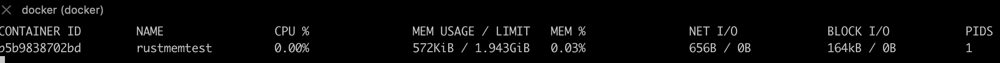
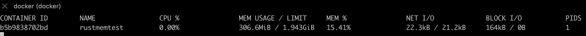

# rustmemtest

Build docker image
```sh
docker build . -t rustmemtest
```
Run docker image
```sh
docker run -p 3030:3030 --name rustmemtest -d rustmemtest
```
Display initial docker stats
```sh
docker stats rustmemtest
```



Call API to allocate memory
```sh
curl http://127.0.0.1:3030
```
Memory increases and does not return to its initial value

